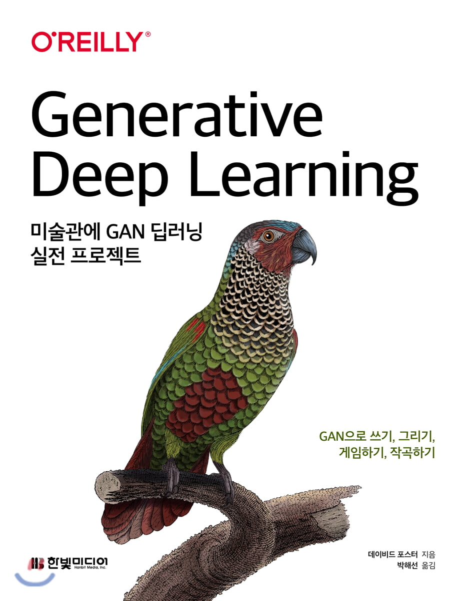

# Let's dive into Deep Learing
### Ref. ==> Generative Deep Learning 미술관에 GAN 딥러닝 프로젝트

- [AE](https://mai-hong.tistory.com/2)(Auto-Encoding)
    - 2019.11.23
    - [Code](./Basic/AE.py)
    - [참조한 링크](https://towardsdatascience.com/applied-deep-learning-part-3-autoencoders-1c083af4d798)

- [VAE](https://mai-hong.tistory.com/3)(Variational Auto-Encoding)
    - 2019.11.24
    - [Code](./Basic/VAE.py)
    - [참조한 링크](https://towardsdatascience.com/understanding-variational-autoencoders-vaes-f70510919f73)
    
    - 2019.11.30 [Update](https://mai-hong.tistory.com/4)
    - [Code-1](./Basic/VAE_CelebA.py) Training
    - [Code-2](./Basic/VAE_CelebA_Analysis.py) Analysis
    - VAE_analysis with CelebA dataset

- [GAN](https://mai-hong.tistory.com/manage/newpost/?type=post&returnURL=%2Fmanage%2Fposts)(Generative Adversarial Networks)
    - 2019.12.13
    - [Code](./Basic/GAN.py)
    - [참조한링크](https://medium.com/@jonathan_hui/gan-whats-generative-adversarial-networks-and-its-application-f39ed278ef09)
    - [참조논문]
        - [Generative Adversarial Network](https://arxiv.org/abs/1406.2661)
        - [NIPS 2016 Tutorial: Generative Adversarial Networks](https://arxiv.org/abs/1701.00160)